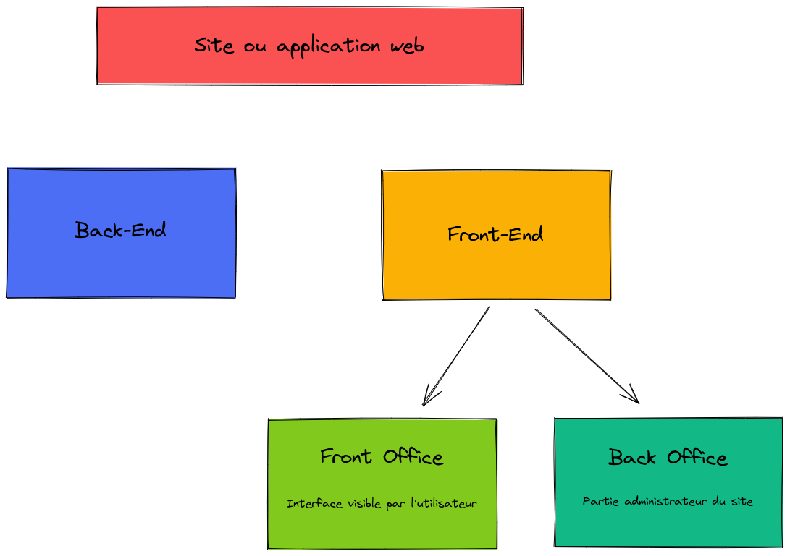

# Memo PHP

## Culture numérique 
### Apache

Apache est un serveur HTTP. 
Son rôle est d'écouter les requêtes émises par les navigateurs (qui demandent des pages web), de chercher la page demandée et de la renvoyer.
### Navigateur

Un navigateur web permet d'accéder à internet et de consulter des pages web. Il est appelé 'client' et fait des requêtes au serveur.

### PHP

PHP est un langage de scripts généraliste et Open Source, spécialement conçu pour le développement d'applications web. Il peut être intégré facilement au HTML. 
PHP est exécuté côté serveur.

### Langage Client

Les langages client décrivent comment le site web doit s'afficher.  
Exemples : HTML, CSS.

### Langage Serveur

Les langages serveur décrivent comment le site web doit se comporter.  
Exemples : PHP, JAVA, C#

### Protocole HTTP

HTTP pour Hypertext Transfert Protocol est un protocole de communication entre un client (le navigateur) et un serveur pour le web.  

### Serveur WEB

Un serveur web est soit un logiciel de service de ressources web, soit un ordinateur qui répond aux requêtes des navigateurs. Il utilise principalement le protocole HTTP.

### Différence entre front-end et front-office / back-end et back-office

## Manip PHP

### Ajouter un titre dynamique dans la balise title

- Dans le fichier header.php :

<title><?= $title ?? 'Mon super Site'?></title>

- Dans le fichier de la page : 

`<?php 
$title = "Mon titre";
?>`

### Concept de Front Controller :

* Front Controller refers to a design pattern where a single component in your application is responsible for handling all requests to other parts of an application. It centralizes common functionality needed by the rest of your application.* 